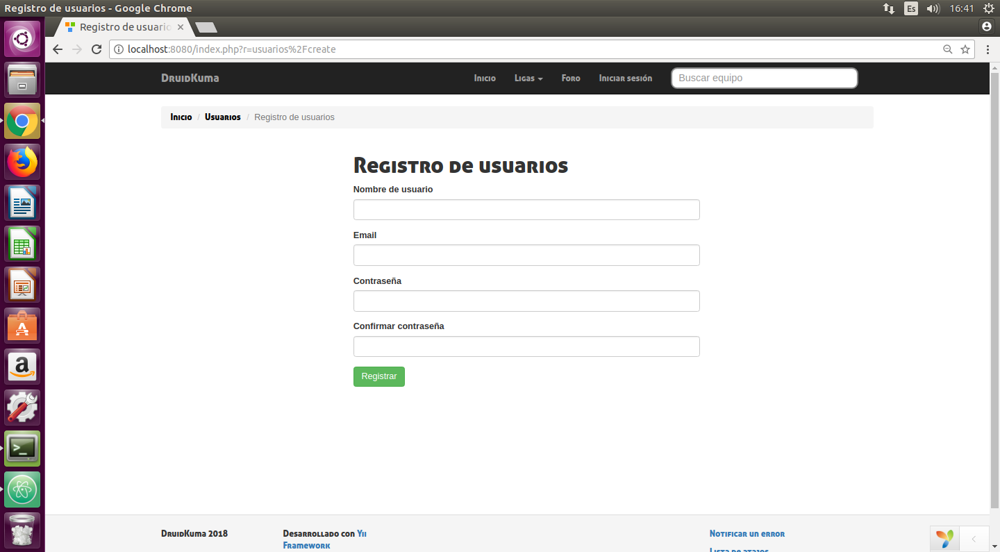

# Manual de usuario

## Registro de un nuevo usuario

Para ello pulsamo en iniciar sesion en el menu y en el enlace create una cuenta

Rellenamos el siguiente cuestionatio y pulsamosel boton registrar

Si el formulario pasa la validacion , se le enviara un correo de confirmacion.
Usted debera revisar su correo y validar la cuenta para poder usarla.

## Noticias

En la pagina inicial de la web podras ver todas las noticias publicadas

Puedes ver los detalles de una noticia en concreto haceidno click en su titulo

## Detalles de las noticias

En ella podras ver toda la informacion sobre una noticia.
Si quieres ver los comentarios sobre esta noticia tendras que pulsar el boton "Ver comentarios", si estas logeado podras comentar

## Ligas

Para ver una liga deberas pulsar sobre el desplegable del menu llamado Ligas y selecciones la liga que desees

Dentro de su liga seleccionada podras ver la clasificacion , con enlaces a informacion de los equipos de forma individual, y mas abajo el calendario de partidos

En el calendario veras rapidamente el resultado de los partidos y si deseas mas informacion puedes hacer click sobre el partido para verla.

## Equipos

De los equipos podras ver las fotos de sus jugadores , su clasificacion en la liga y sus partidos

## Partidos

Se crea una ventana nueva con informacion del partido y sus comentarios

## Foro publico

En el podras crea,ver y comentar publicaciones. Si eres el creador de un foro podras eliminarlo.

## Detalle de la publicaciones

En el podras ver informacion mas detalleda de la publicacion y los comentarios al respecto.

## Mis Equipos

Podras ver los diferentes equipos en los que participas.
Podras acceder a su foro y si eres el creador podras añadir participantes o eliminar el equipo.

## Detalles del equipo (o su foro)

Podras ver los participantes y las publicaciones de ese equipo.
Si eres el creador del equipo podras eliminar participantes

Explicar, incluyendo capturas de pantalla.
